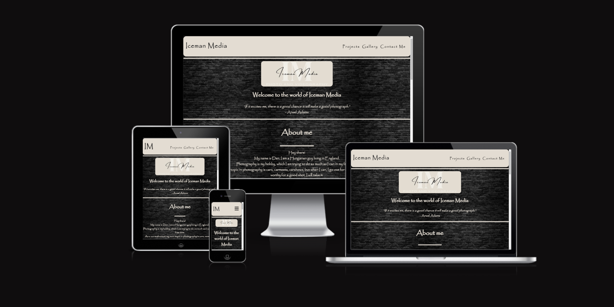
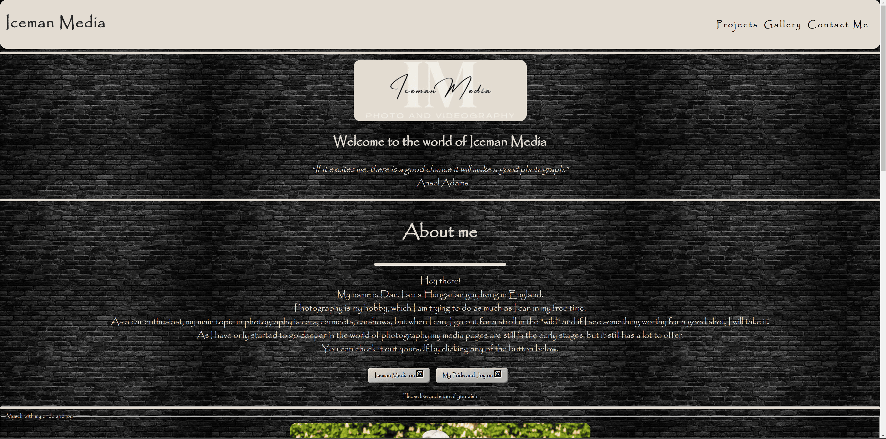
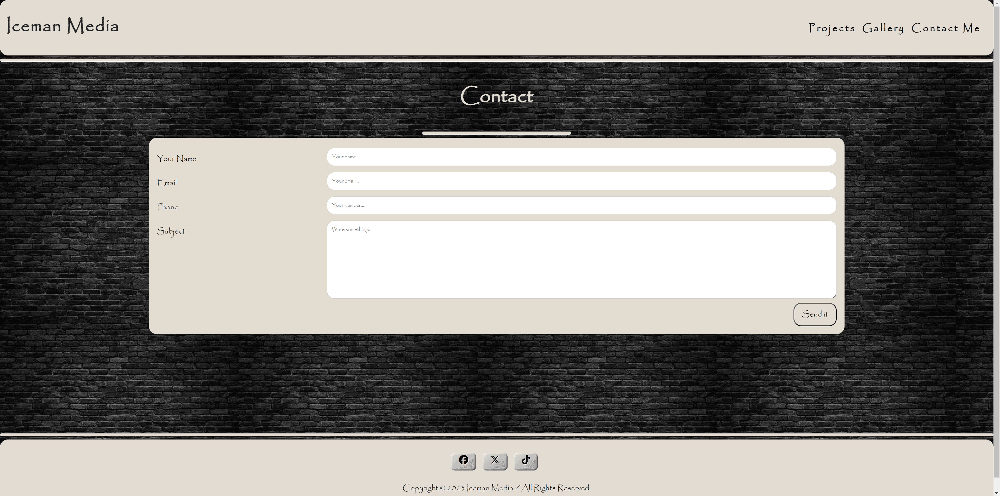
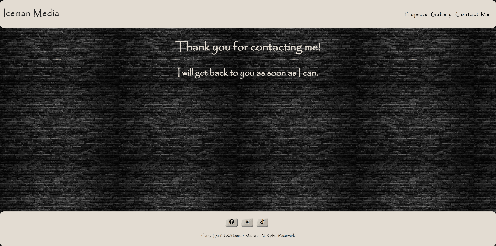
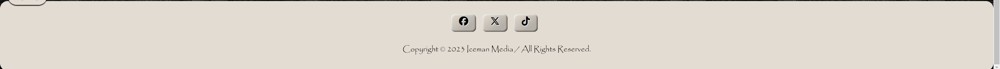
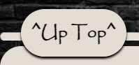

# Iceman Media

Iceman Media is my personal photography website, but it's not only an introductory site. In the hopefully near future, when the website will be finished it will offer a gallery for the ones who want to see my hobby and work, but also it will be a showroom for people who want to be my customer and wish to receive a full website for their own or company with self made professional photography and unique design.

For more visit here: https://is2dann.github.io/Iceman-Media-new

***

## User Stories 
|Story No.|Story|
| ------------- | ------------- |
|1| As a user/amateur photographer,   I want to know something about a person who does photography that I like.    I know I did a good job when other users will see my introduction as soon as they open my website. |
|2| As a user/amateur photographer,   I want to be able to see this persons social media sites for their other work.    I think it's good to have these links in the center of sight to be sure they will be visited. |
|3| As a user/amateur photographer,   I want to get advice from a person more professional than I am.    I know I am done when a even a little advice will be available on my website for free.|
|4| As a user/amateur photographer,   I want to know about other works this person does and any future plans   for the possibility of working together.    I know I am done when people can read about this after my introduction.|
|5| As a user/amateur photographer,   I want to be able to see this person work without going to any external sites   for example a gallery.    I know I am done when some pictures and videos will be available in the gallery section. |
|6| As a user/amateur photographer,   I want to be able to reach out to this person with an enquiry or just a question.    I know I am done when this is available via a contact form. |

***

## Wireframes
Below are the designs that were used to build the site.

| Landing page |
| ------- |
|  |

| Gallery |
| ------- |
|  |

| Contact |
| ------- |
|  |

| Thank You |
| ------- |
|  |

***

| Landing-page : Desktop |
| ------- |
|  |

| Landing Page : Mobile |
| ------- |
|  |
***

## Features

-__Typography and Color scheme__

__Note: The font has been changed to Papyrus for compatibility reasons.__ 
I wanted to go simple yet stylish on the design. 
The whole website originally used the font (cursive) and the color scheme is basically tan (#E4DCD1) and black (#000000).
Has a black brick background and a hint of (aqua) resembling "ice" to spice up some parts (see "send it" button).

### Existing features

-__Header as navigation bar__
* Includes four links total. 
    - The name is directs to the top of the first page from any other page.
    - The "Projects" takes the user to the corresponding part of the first page.
    - The "Gallery" is the second page of the website.
    - The third page is the "Contact me"
* All links are responsive and consistent on all four pages, plus on the "Thank You" page (which can be seen through filling out the contact form).
- * Changed the header nav bar later in my development as my original plan was responsive, but I was not satisfied with the outcome.

| Header Bar : Desktop |
| ------- |
|  |

| Header Bar : Mobile |
| ------- |
|  |
    
    
-__Header part 2__
* Below the header, a small section contains:
    - A logo (made by me using [Canva-logo-creator](https://www.canva.com)).
    - A welcome message.
    - A short quote from a famous photographer.

-__The introduction section__
* The "About me" section contains a short introduction, hence the title.
* It also has two link to two separate Instagram profiles as my main reaching point for all media. Basically Instagram centers most of my media, therefore I code this section to center the links.
* Both links styled as a button, and works like a normal link would. Also opens in a new tab. Although the links are not blue, nor will turn purple after visit.

* Below this a framed picture of me can be found.

-__Ingredients__
* This section is just short useful filler.
* Ingredients for good photos and videos

-__Projects__
* This section is the second big part of the first page. Although now only is a short summary of what I am doing and what will be doing.
* The section contains three dropdowns so the sections inside are playful/engaging and well visible separately. Specially on smaller screens.

| Projects dropdown closed |
| ------- |
|  |

| Projects dropdown opened |
| ------- |
|  |

-__Gallery__
* The gallery is the second page.
* Two sections: "Pictures" and "Videos"

| Gallery: Pictures section |
| ------- |
|  |

| Gallery: Tablet screen |
| ------- |
|  |

| Gallery: Mobile screen |
| ------- |
|  |

* Pictures are presented large, even larger "on hover" and can be opened full size "on click".

* Pictures are linked from an external photoshare website, so they can be viewed full size, and can be downloaded.
* Videos are linked straight from youtube, therefore can be viewed in all sizes, on all devices with full control and doesn't slows down the website.
    - Also another reason for youtube links: Videos can be found on my personal youtube channel.

-__Contact me__
* This is the third page. Named as it is.
* Basically an enquiry/contact form.
* Contains: name, email, number, message and a submit button.

| Contact Form |
| ------- |
|  |

| Contact Form on mobile |
| ------- |
|  |

* All data are required. After successful filling a "Thank You" page appears.

-__Footer__
* The footer in my case is large to attract attention to my other links (only Facebook and twitter/X , because Instagram is in the "About me" section and Youtube will be in the Videos section).
* Relevant copyrights, names and dates.

-__Top of the page button__
* The website does have a "Go to the top" button. Named "Up Top". It fulfills it's purpose, although I placed unconventionally to the left side as in the future I would like to give the option to go to the top with a click, but I don't wish to encourage it, so the user surely will see everything I offer.

-__Features left to implement__
* Projects section will be longer and well presented with pictures about what will I be doing.
* Gallery will be expanded to more sections (Websites will be added). Pictures will be sectioned to themes. Sizes will be changed accordingly. Websites section will probably hold links to all my work.
* Contact here section will contain actual contact info. Also will be other sections separating: contact, sign up and requests.

## Technologies Used

### Languages Used

HTML and CSS

### Used Programs/Websites

* Github - Used to save project
* Visual Studio Code - Used as a developer platform  
* i.postimg.cc - Used to upload my pictures
* Youtube.com - Used to upload and link my video
* Google Chrome Developer Tools  - Used to review project

## Deployment & Local Development

### Deployment

The site is deployed using GitHub Pages - [Iceman Media](https://is2dann.github.io/Iceman-Media-new/).

To Deploy the site using GitHub Pages:

1. Login (or signup) to Github.
2. Open my repository.
3. Click the settings button.
4. Select pages in the left hand navigation menu.
5. From the source dropdown select main branch and press save.
6. The site has now been deployed, please note that this process may take a few minutes before the site goes live.

## Testing

-__Manual testing__
* Can be found here: [TESTING.md](TESTING.md)

### HTML Validator
* Validator showed lots of errors first when I transferred my project over from repl.it to VS code. After I fixed all of these, finished the project. At this point only had some minor incompatibilies, but all that been fixed and now the website is error free.

- Index: No errors were returned when passing through the official W3C validator https://validator.w3.org/nu/?doc=https%3A%2F%2Fis2dann.github.io%2FIceman-Media-new%2Findex.html

- Gallery: No errors were returned when passing through the official W3C validator https://validator.w3.org/nu/?doc=https%3A%2F%2Fis2dann.github.io%2FIceman-Media-new%2Fgallery.html

- Contact Me: No errors were returned when passing through the official W3C validator https://validator.w3.org/nu/?doc=https%3A%2F%2Fis2dann.github.io%2FIceman-Media-new%2Fcontact.html

- Thank You: No errors were returned when passing through the official W3C validator https://validator.w3.org/nu/?doc=https%3A%2F%2Fis2dann.github.io%2FIceman-Media-new%2Fthankyou.html%3Fname%3Dd%26email%3Da%2540a.com%26phone%3D0%26subject%3Da

### CSS Validator
* In CSS I had a couple of unnesessary items, but now this is error free as well. https://jigsaw.w3.org/css-validator/validator?uri=https%3A%2F%2Fis2dann.github.io%2FIceman-Media-new%2Findex.html&profile=css3svg&usermedium=all&warning=1&vextwarning=&lang=en

### Lighthouse
* Luckily when I first used Google lighthouse, this result came back.

| Index |
| ------- |
|  |

| Gallery |
| ------- |
|  |

| Contact Me |
| ------- |
|  |

| Thank You |
| ------- |
|  |

### Solved Bugs

|No.|Bug| Solution|
| :--- | :--- | :--- |
|1.|First contact form idea was written in a way, that could not be properly used with different screen sizes.|Changed the contact form completely to a more useful format.|
|2.|Original font I used (cursive) could not be used with Apple products. Iphone, Ipad displayed different font.|I changed the font to (papyrus). Now all platform can show it. And I actually like it more.|
|3.|Original header I used could not be made for responsive design at all|I recoded a more simple design that works well on different screensizes.|

### Unsolved Bugs

The page has only one unsolved bug. At the "Videos" section the video itself goes a little bit out of the screen on phone only and only when the phone is in vertical position.

## Credits

### Used Code

For the code writing I was following the learning material from CodeInstitute of course. But also when something was a bit unclear I took help from [w3schools](www.w3schools.com).
When I needed more help I was browsing [stackoverflow](www.stackoverflow.com)

### Content/Images/Videos

* As this website is my own introductory site all content is written by me.
* As well as all pictures is photographed and edited by me.
* Just like the video as well.
* The background image is the only image i borrowed from i.postimg.cc

## Acknowledgments
**Special thanks to my mentor Daniel Hamilton who helped a lot so far, with setting up programs, giving tips about the page and a lot more**